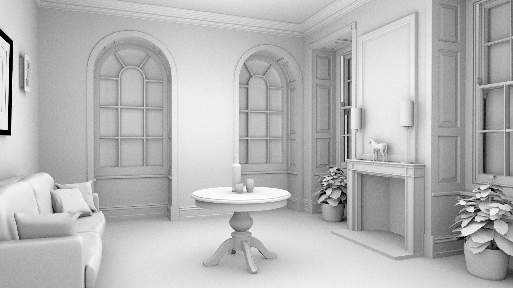
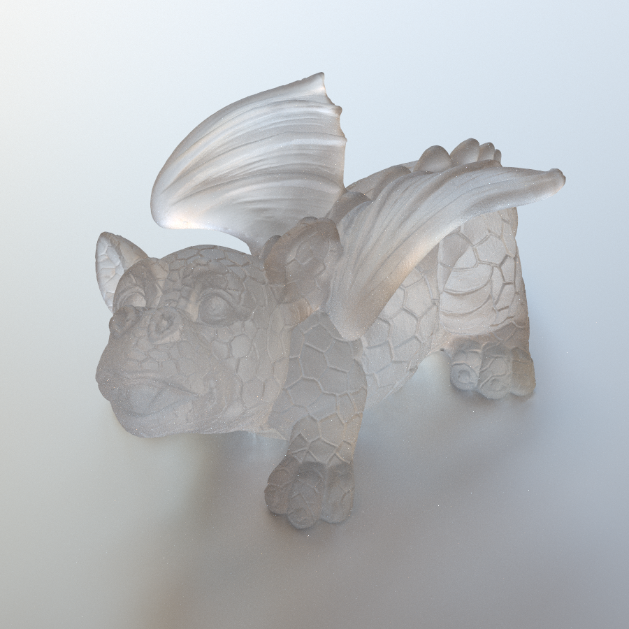
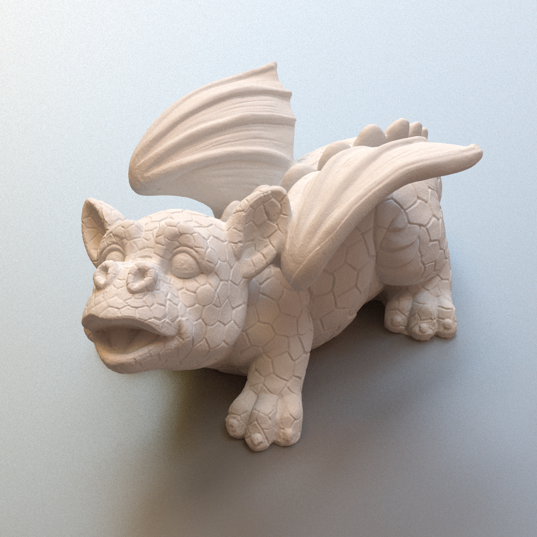
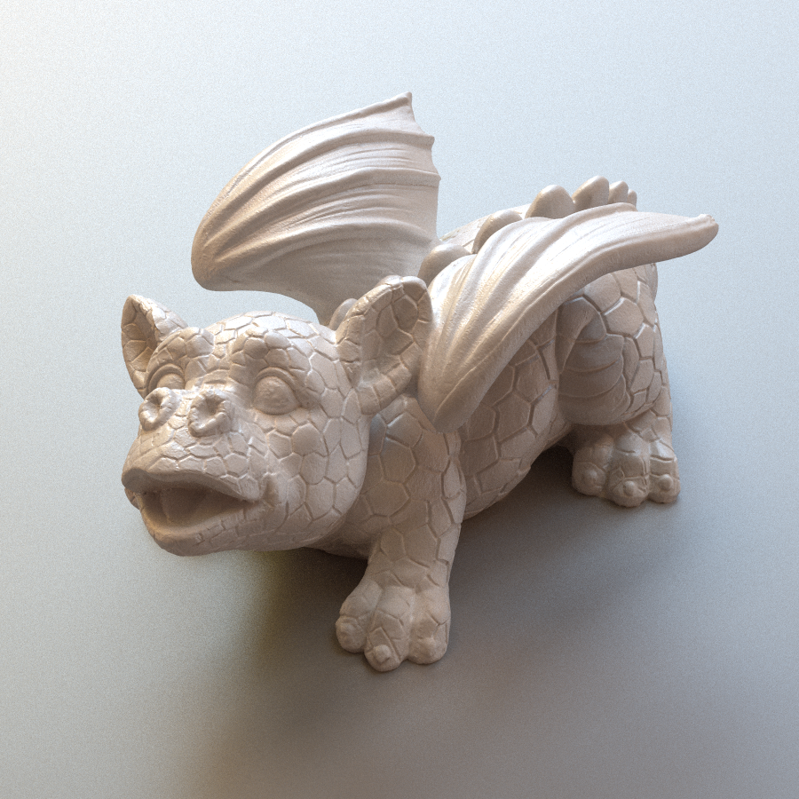
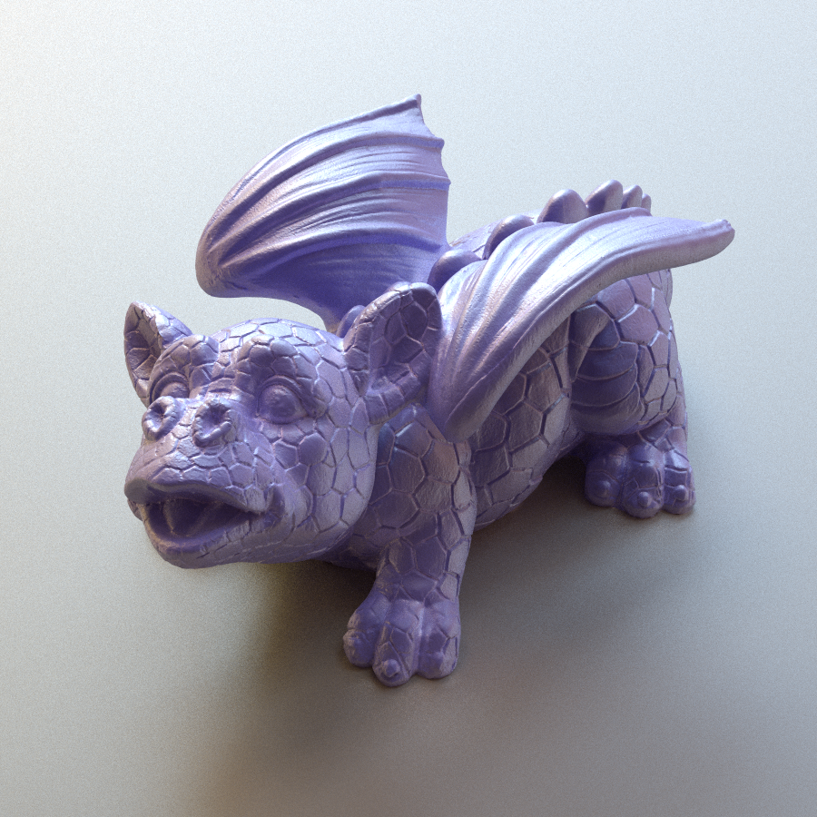
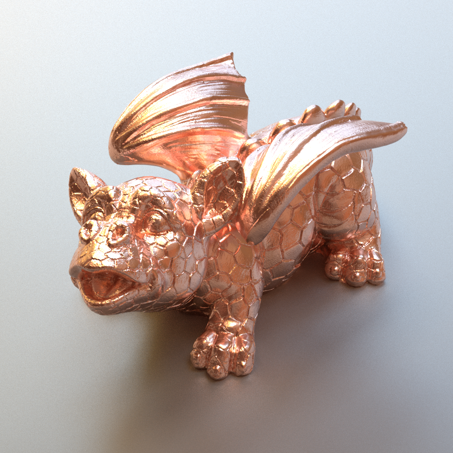
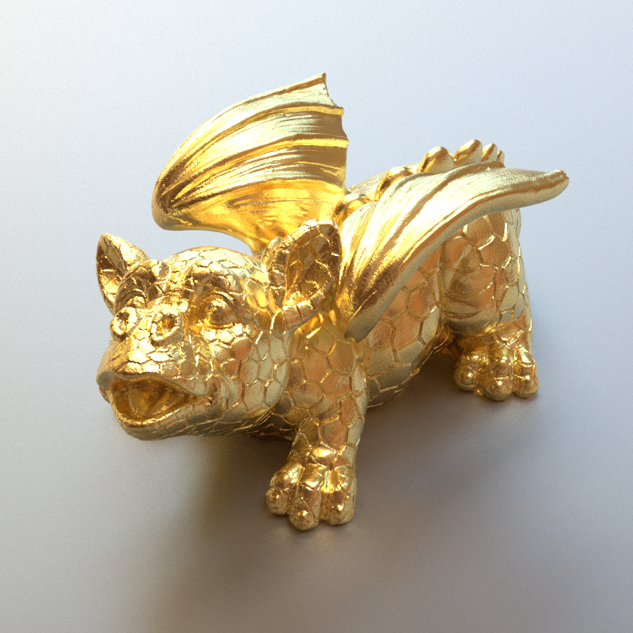
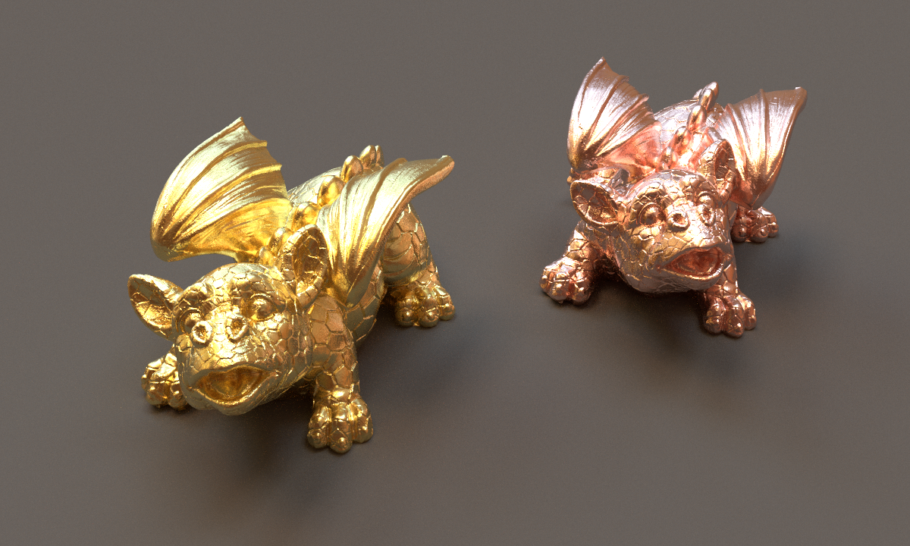

# minpt: a tiny c++ path tracer




minpt is a tiny c++ path tracer written for learning Matt Pharr's book *" Physically Based Rendering: From Theory to Implementation"*. Most of codes and ideas come from PBRT and nori ray tracer, but with a lot of simplification.

## Building minpt

To check out minpt together with all dependencies, be sure to use the `--recursive` flag when cloning the repository, i.e.

```bash
$ git clone --recursive https://github.com/guijiangheng/minpt.git
```

If you accidentally already cloned minpt without this flag (or to update an minpt source tree after a new submodule has been added, run the following command to also fetch the dependencies:

```bash
$ git submodule update --init --recursive
```

minpt uses [cmake](http://www.cmake.org/) for its build system. After clone the source code, use below commnads to start compling:

```bash
mkdir build && cd build
cmake ..
make -j4
```
Or you can open repository root folder directly with visual studio 2019.

## Gallery










<video width="800" controls>
  <source src="./gallery/metal-material.webm.mov" type="video/webm">
</video>

## Demo Scene

Example scenes can be obtained from [Morgan McGuire's Computer Graphics Archive](http://casual-effects.com/data/).

## Author

GuiJiangHeng [Twitter](https://twitter.com/guijiangheng)
